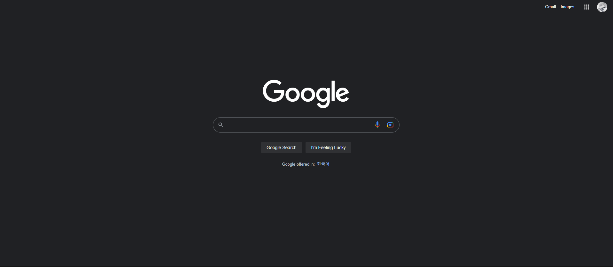

<h3>
    <a href="https://www.figma.com/file/5jxhYRLV8qbNpPAkSBP0WG/%E2%9D%96-Untitled-UI-%E2%80%93-FREE-Figma-UI-kit-and-design-system-(Community)?node-id=1025%3A31781&t=mFPMNi9Hvb7LM1Fq-1">아이콘 참조용 피그마 링크</a>
</h3>
  
</img>

 

### 참고링크
---
- [인라인과 블록](http://www.tcpschool.com/html/html_space_blockInline)
- [인라인과 블록2](https://memostack.tistory.com/275)
- [중앙정렬](https://webdir.tistory.com/31)
- [class와 id](https://heinafantasy.com/155)
- [인라인 요소 속성](https://aboooks.tistory.com/171)